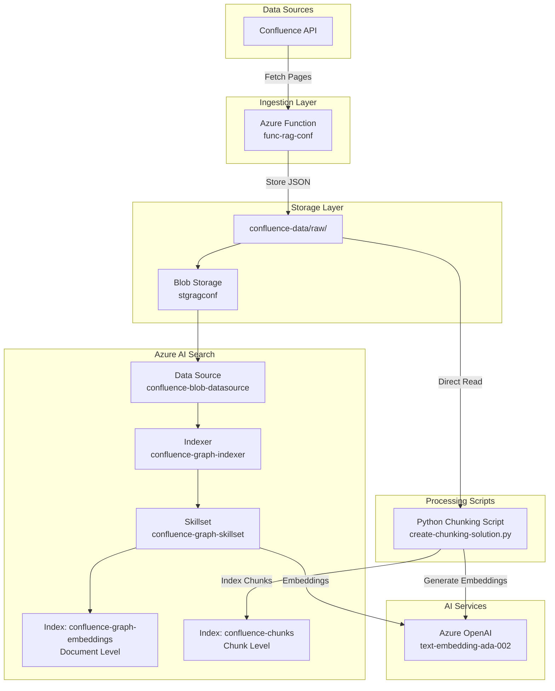
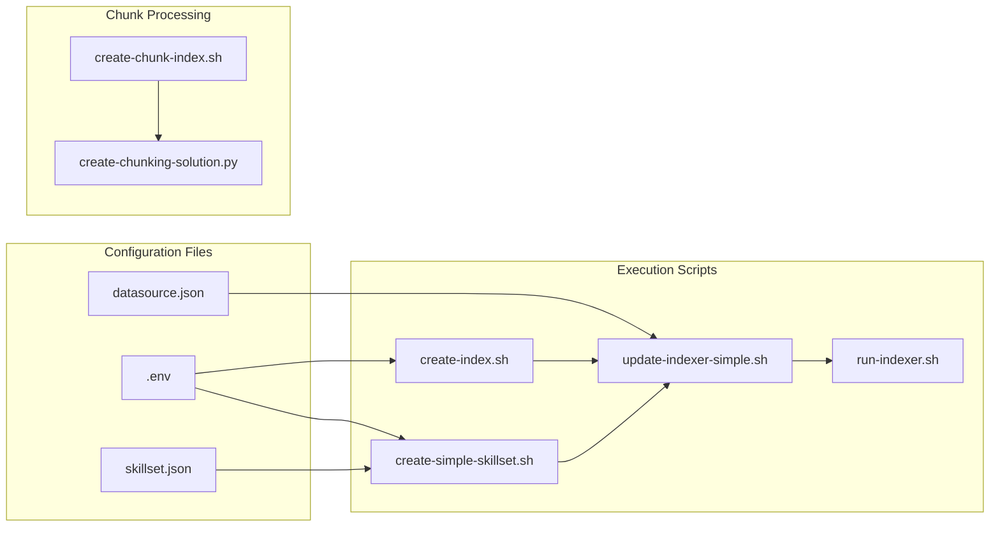

# Azure Search Architecture and Data Flow

## Complete System Architecture



## Data Processing Flow

### 1. Document-Level Indexing Flow
```
Raw JSON → Indexer → Field Mapping → Skillset → Embeddings → Index
```

### 2. Chunk-Level Indexing Flow
```
Raw JSON → Python Script → Chunking → Embeddings → Chunk Index
```

## File Dependencies



## API Call Sequence

### Document Indexing Sequence
```sequence
User->Script: bash create-index.sh
Script->AzureSearch: PUT /indexes/confluence-graph-embeddings
AzureSearch->Script: 201 Created

User->Script: bash create-simple-skillset.sh  
Script->AzureSearch: PUT /skillsets/confluence-graph-skillset
AzureSearch->Script: 201 Created

User->Script: bash update-indexer-simple.sh
Script->AzureSearch: PUT /indexers/confluence-graph-indexer
AzureSearch->Script: 201 Created

User->Script: bash run-indexer.sh
Script->AzureSearch: POST /indexers/confluence-graph-indexer/run
AzureSearch->BlobStorage: Read JSON files
BlobStorage->AzureSearch: Return documents
AzureSearch->AzureOpenAI: Generate embeddings
AzureOpenAI->AzureSearch: Return vectors
AzureSearch->Index: Store documents
```

### Chunk Indexing Sequence
```sequence
User->Python: python3 create-chunking-solution.py
Python->BlobStorage: List blobs in raw/
BlobStorage->Python: Return blob list
Python->BlobStorage: Download each JSON
Python->Python: Chunk text (2000 chars)
Python->AzureOpenAI: Generate embedding for chunk
AzureOpenAI->Python: Return embedding vector
Python->AzureSearch: Upload chunk document
AzureSearch->ChunkIndex: Store chunk
```

## Resource Naming Convention

| Resource Type | Naming Pattern | Example |
|--------------|----------------|---------|
| Resource Group | rg-{project}-{env} | rg-rag-confluence |
| Storage Account | stg{project}{env} | stgragconf |
| Search Service | srch-{project}-{env} | srch-rag-conf |
| Azure OpenAI | aoai-{project}-{env} | aoai-rag-confluence |
| Function App | func-{project}-{env} | func-rag-conf |
| Index | {content}-{type} | confluence-chunks |
| Skillset | {content}-{type}-skillset | confluence-graph-skillset |

## Error Handling Points

1. **Blob Storage Access**: Connection string validation
2. **Skillset Execution**: Azure OpenAI API limits
3. **Indexer Run**: Document parsing errors
4. **Embedding Generation**: Token limits (8191 for ada-002)
5. **Chunk Upload**: Batch size limits (100 documents)

## Performance Metrics

- **Document Processing**: ~1 second per document
- **Embedding Generation**: ~0.5 seconds per chunk
- **Index Upload**: ~0.1 seconds per chunk
- **Total Processing Time**: ~2-3 minutes for 23 documents


          ┌─────────────────────┐
          │   Confluence API    │
          └────────┬────────────┘
                   ↓
          ┌─────────────────────┐
          │ Azure Function (ETL)│
          │ func-rag-conf       │
          └────────┬────────────┘
                   ↓
          ┌─────────────────────┐
          │ Blob Storage        │
          │ (raw JSON)          │
          └────────┬────────────┘
            ┌──────┴───────┐
            ↓              ↓
┌────────────────┐   ┌─────────────────────┐
│Document Indexer│   │Python Chunk Script  │
│(Indexer + SS)  │   │(create-chunking...) │
└──────┬─────────┘   └────────┬────────────┘
       ↓                     ↓
┌──────────────┐      ┌──────────────┐
│ Azure OpenAI │      │ Azure OpenAI │
│ (Embeddings) │      │ (Embeddings) │
└──────┬───────┘      └──────┬───────┘
       ↓                     ↓
┌──────────────┐      ┌──────────────┐
│ Document     │      │ Chunk        │
│ Index        │      │ Index        │
│ (confluence- │      │ (confluence- │
│ graph-embed) │      │ chunks)      │
└──────┬───────┘      └──────┬───────┘
       ↓                     ↓
       └──────┬──────────────┘
              ↓
     ┌──────────────────────┐
     │ Agentic RAG Workflow │
     │ (Retrieval + GPT)    │
     └────────┬─────────────┘
              ↓
     ┌──────────────────────┐
     │ Frontend (React UI)  │
     └──────────────────────┘